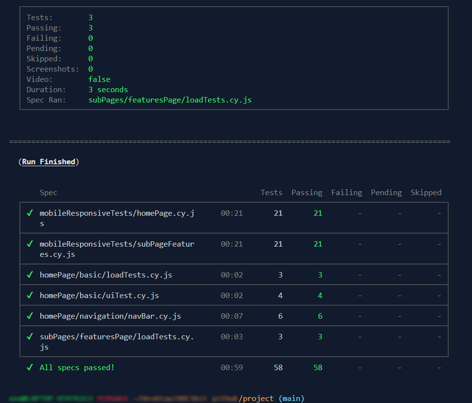
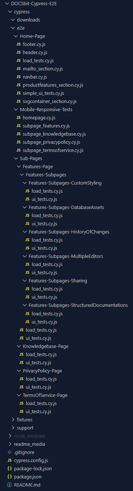

# DOCSbit Cypress E2E Tests Repository

## Introduction

Welcome to the DOCSbit Cypress Test Repository. This document outlines a collection of superficial, user experience-driven end-to-end tests developed for the DOCSbit web application using the Cypress testing framework. The focus is on simulating straightforward, real user interactions to ensure basic functionality and performance across different scenarios.

## Environment configuration

To run tests on a new computer, you must configure the environment. This process includes the following steps:

### Entrance requirements

### Node.js

Before you start working with the repository, make sure that Node.js is installed on your computer. Node.js is essential for managing project dependencies and running Cypress tests.

If you don't have Node.js, you can download and install it from [Node.js official website](https://nodejs.org/).

### Git

Git is used to clone a repository from GitHub. If you don't have Git on your computer, you can install it by following the instructions below:

1. **Download Git**  
   Go to [Git official website](https://git-scm.com/) and download the appropriate version for your operating system.

2. **Git installation**  
   Open the downloaded installation file and follow the installation instructions. During installation, it is recommended to select the option that adds Git to the PATH environment variable.

3. **Checking the installation**  
   Once the installation is complete, open a terminal (CMD or PowerShell on Windows, Terminal on macOS or Linux) and type the following command to verify that Git has been installed correctly:

   ```bash
   git --version
   ```

You should see the version of Git installed, confirming that it is ready to use.

### Installation and configuration of the project

1. **Cloning the Repository**: Clone the repository using the command:

   ```bash
   git clone https://github.com/dz0mmm/test-2.git
   ```

2. **Installing dependencies**: Go to the repository directory and execute the command:

   ```bash
   npm install
   ```

   this command will install all necessary dependencies.

3. **Running Tests**: You can run the tests using the command:

   ```bash
   npx cypress open
   ```

   for interactive user interface or

   ```bash
   npx cypress run
   ```

   for headless type. The above two commands are also added to the `package.json` file and defined as**npm run test:open:gui** and **npm run test:all**.

### Available scripts

There are several scripts defined in the `package.json` file that allow you to easily run Cypress tests:

Launches Cypress in GUI mode, allowing you to interactively select and track tests:

```bash
npm run test:open:gui
```

<p align="center">
  
   <br>
  <em>Last photo update: April 25, 2024</em>
</p>

Cypress welcome screen. After launching the Cypress UI, select the "E2E Testing" tab on the home screen.

<p align="center">
  
   <br>
  <em>Last photo update: April 25, 2024</em>
</p>

Browser selection for E2E testing. On this screen you can select your preferred browser for testing. Select Chrome and click "Start E2E Testing in Chrome" to start testing in your chosen browser.

<p align="center">
  
   <br>
  <em>Last photo update: April 25, 2024</em>
</p>

List of test specifications. Once you navigate to E2E testing, you will see a list of available test specifications. Select the sample test (file with the extension .cy.js) that you want to run.

<p align="center">
  
   <br>
  <em>Last photo update: April 25, 2024</em>
</p>

Test results. After selecting a test, you will be taken to the results screen where each test case is visualized and you can observe the progress and results of the tests.

Runs all Cypress tests available in the project in headless mode on popular browsers:

```bash
npm run test:all:browsers
```

   <p align="center">
  
   <br>
  <em>Last photo update: April 25, 2024</em>
</p>

Above is a final summary of all run specifications (Run Finished), with a list of individual tests and their execution time.

Runs all responsiveness tests for various mobile devices (mobileResponsiveTests)

```bash
npm run test:mobileResponsive
```

Runs all basic tests for the project's homepage (homePage):

```bash
npm run test:homePage:all
```

Runs all tests for the (subPages) section:

```bash
npm run test:subPages:all
```

Runs functionality tests for a subpage (features) in the (subPages) section:

```bash
npm run test:subPages:features
```

Runs functionality tests for a subpage (kwowledgebase) in the (subPages) section:

```bash
npm run test:subPPages:knowledge
```

### Repository structure

The repository consists of the following folders and files:

<p align="center">
  
   <br>
  <em>Last photo update: April 25, 2024</em>
</p>

- `cypress` - Home directory for Cypress tests and related resources.
  - `downloads` - Folder to store files downloaded during testing.
  - `e2e` - Includes end-to-end (E2E) tests.
    - `homePage` - Tests for the application home page.
      - `loadTests.cy.js` - Home page loading tests.
      - `uiTest.cy.js` - Home page basic UI tests.
      - `footer.cy.js` - Footer tests.
      - `header.cy.js` - Header tests.
      - `navbar.cy.js` - Navigation bar tests.
      - `SVGContainerSection.cy.js` - SVG container tests.
      - `productFeaturesSection.cy.js` - product features tests.
      - `MailToSection.cy.js` - MailTo tests.
    - `mobileResponsiveTests` - Application responsiveness tests on mobile devices.
      - `homePage.cy.js` - Homepage responsiveness tests for mobile devices
      - `subPageFeatures.cy.js` - Responsiveness tests of the features subpage for mobile devices.
    - `subPages` - Tests for subpages.
      - `featuresPage` - Tests for the features subpage.
        - `loadTests.cy.js` - Features subpage loading tests.
      - `knowledgebasePage` - Tests for the knowledgebase subpage.
        - `loadTests.cy.js` - Knowledgebase subpage loading tests.
  - `fixtures` - Contains test data used in tests.
  - `screenshots` - A folder for storing screenshots taken during failed tests.
  - `support` - Contains support files that can be used globally for all tests.
- `readme_media` - Directory for images and graphical resources used in documentation (README.md).
  - `gui_test_step_1.png` - An image showing the first step of GUI testing.
  - `gui_test_step_2.png` - An image showing the second step of GUI testing.
  - `gui_test_step_3.png` - An image showing the third step of GUI testing.
  - `gui_test_step_4.png` - An image showing the fourth step of GUI testing.
  - `project_folder_structure.png` - An image showing the project's directory tree.
  - `run_all_tests.png` - An image showing all tests running in headless mode.
- `node_modules` - Folder containing Node.js modules installed by npm.
- `.gitignore` - A Git configuration file that specifies the files and folders that the version control system ignores.
- `cypress.config.js` - The main Cypress configuration file where test settings and configuration are defined.
- `package.json` - A manifest file for Node.js specifying project metadata and dependencies.
- `README.md` - A project documentation file that should contain information about the project, installation instructions, usage instructions, and other useful information.

The above structure provides an orderly way to organize tests and their dependencies.

_© danz0m, 2024_
